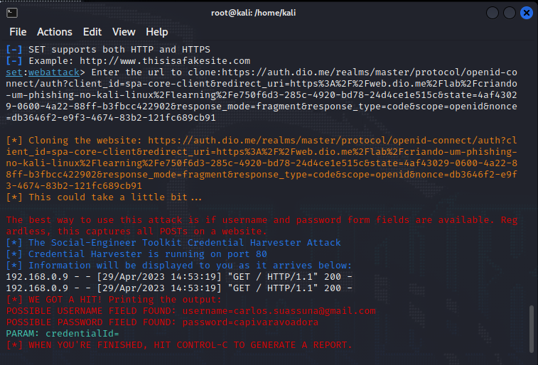

# Phishing para captura de senhas

### Ferramentas

- Kali Linux
- setoolkit

### Configurando o Phishing no Kali Linux

- Acesso root: ``` sudo su ```
- Iniciando o setoolkit: ``` setoolkit ```
- Tipo de ataque: ``` Social-Engineering Attacks ```
- Vetor de ataque: ``` Web Site Attack Vectors ```
- Método de ataque: ```Credential Harvester Attack Method ```
- Método de ataque: ``` Site Cloner ```
- Obtendo o endereço da máquina: ``` ifconfig ```
- URL para clone: https://auth.dio.me/realms/master/protocol/openid-connect/auth?client_id=spa-core-client&redirect_uri=https%3A%2F%2Fweb.dio.me%2F&state=7402a09a-0067-4ca7-8b3c-1176dc2ac6c6&response_mode=fragment&response_type=code&scope=openid&nonce=9ed8c2ca-0619-44b4-86e4-c4a4416063f1

### Resutados


